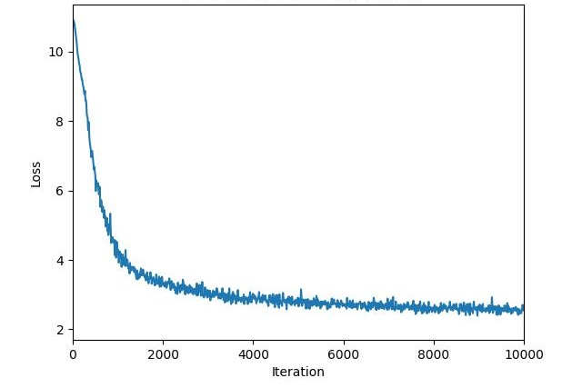
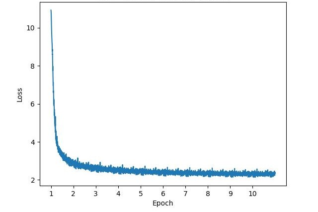

# System Requirements
## Hardware requirements
PromptNet package requires only a standard computer with enough RAM to support the operations defined by a user. For minimal performance, this will be a computer with about 2 GB of RAM. For optimal performance, we recommend a computer with the following specs:
```
RAM: 16+ GB
CPU: 4+ cores, 3.3+ GHz/core
GPU: 2+ V100
```
The runtimes below are generated using a computer with the recommended specs.

## Software requirements
This package is supported for Linux. The package has been tested on the following system:
```
Linux: Ubuntu 16.04
```
## Environment
Clone the repo
```
git clone https://github.com/ai-in-health/PromptNet
```
Install dependencies
```
conda create -n PromptNet python==3.9
conda activate PromptNet
# install a proper version of PyTorch
# see https://pytorch.org/get-started/previous-versions/
pip install pytorch>=1.10.1 torchvision>=0.11.2 torchaudio>=0.10.1 pytorch-cuda==11.8 -c pytorch -c nvidia

# install the rest dependencies
pip install -r requirement.txt
```
which should install in about 5 mins. We can run the code under `torch==2.0.1` and `torchvision==0.15.2`. Other versions may work.

## Pre-trained Model
We provide a quick implementation of our method.

First, you should download the pre-trained models and prompts from [Google Drive](https://drive.google.com/drive/folders/1I0ZlSA_onTkhj7uZd9BHlJgSGRaFNLL0?usp=sharing).
| Type | File Name | 
| :--- | :--- |
| Prompts | prompt.pth |
| Few-shot Model (1%) | few-shot.pth |
| Fully-supervised Model (100%) | fully-supervised.pth |

Then, you can directly run the following command to process your own medical images:
```
export model_weights=few-shot.pth
or
export model_weights=fully-supervised.pth
python inference.py \
--prompt='./prompt/prompt.pth' \
--load='./ckpt/${model_weights}' \
--image_path='./example_figs/fig1.jpg' 
```
## Training Curves 



## Data
```
The root of this repo/
    mimic_cxr
    ├── annotation.json             # MIMIC_CXR dataset
    ├── images
    │   ├── p10               
    │   ├──  .
    │   ├──	 .
    │		└── p19
    finetune
    ├── annotation.json             # Downstream dataset
    ├── images
    │   ├── patient 1               
    │   ├──  .
    │   ├──	 .
    pretrained
    ├── resnet
    │		└── pytorch_model.bin
    │
    decoder_config
    │		└── decoder_config.pkl      # configuration file for model
    │
    model_weights	
    │		└── few-shot.pth
    │		└── fully-supervised.pth
    │
    prompt
    │		└── prompt.pt
    │
    └── ...
```
The `data` folder contains the following subfolders:
- The `mimic_cxr` folder contains MIMIC-CXR image data and corresponding annotation (eg., image id, report etc...).
- The `finetune` folder contains the image data and corresponding annotation (eg., image id, report etc...) of the downstream dataset. 
- The `pretrained` folder contains the initialized weights for our encoder which will download automatically when you run the code.
- The `decoder_config`, `model_weights` and  `prompt` folders contain the configuration file of the model, its weights, and the support prompt in the inference stage, respectively.

## Datasets
We provide the links for quick downloading datasets.

| Dataset | 
| :--- | 
| [COVIDx-CXR-2](https://alexswong.github.io/COVID-Net/)  |
| [COVID-CXR](https://github.com/ieee8023/covid-chestxray-dataset) | 
| [BIMCV-COVID-19](https://bimcv.cipf.es/bimcv-projects/bimcv-covid19/) |
| [MIMIC-CXR](https://physionet.org/content/mimic-cxr/2.0.0/) | 
| [NIH ChestX-ray](https://nihcc.app.box.com/v/ChestXray-NIHCC) | 

## Training
Here is an example of running command:
```
export dataset=mimic-cxr
python PromptNet.py \
--image_dir='./${dataset}/images' \
--json_path='./${dataset}/annotation.json' \
--dataset=${dataset} \
--max_seq_length=100 \
--threshold=10 \
--bs=32 
```

## Fine-tuning
Here is an example of running command:
```
export dataset=downstream_dataset
python PromptNet.py \
--train_mode=fine-tuning \
--image_dir='./${dataset}/images' \
--json_path='./${dataset}/annotation.json' \
--dataset=${dataset} \
--max_seq_length=100 \
--threshold=10 \
--bs=32 \
--prompt='./prompt/prompt.pt' \
--prompt_load=yes \
--random_init=no \
--weight_path='./model_weights/${model_weights}' \
```

## Evaluation

Here is an example of running command:
```
export dataset=downstream_dataset
python test.py \
--dataset='$dataset' \
--max_seq_length=100 \
--threshold=10 \
--epochs=10 \
--bs=16 \
--load='./your_model_weights' 
```
You could specify `$dataset` to load your own corpus. Our method can be tested within 10 mins on a single V100 GPU

## Notes
1. To evaluate report generation, ensure that your system has installed JAVA. Here is an example:
   - Download from the official website (https://www.java.com/en/download/manual.jsp) to obtain, e.g., jdk-8u333-linux-x64.tar.gz
   - Unzip the file by running `tar -zxvf jdk-8u333-linux-x64.tar.gz`, and you will see the jre folder
   - Write the following lines to ~/.bashrc:
     - `echo "export JRE_HOME=path/to/jre" >> ~/.bashrc`
     - `echo "export PATH=${JRE_HOME}/bin:$PATH" >> ~/.bashrc`
   - Activate the settings by running `source ~/.bashrc`
   - See if the java has been installed: `java -version`
2. You should install packages `pycocoevalcap` and `pycocotools` (included in `requirement.txt`).
3. When calculating the `SPICE` metric, the code will try to automatically download two files `stanford-corenlp-3.6.0.jar` and `stanford-corenlp-3.6.0-models.jar`, and save them to ${pycocoevalcapPath}/spice/lib/. If you encounter a network issue, you can prepare these two files by yourself:
   - Download a zip file from https://nlp.stanford.edu/software/stanford-corenlp-full-2015-12-09.zip
   - Unzip it to get the above two files
   - Run `pip show pycocoevalcap` to see where the package has been installed
   - Move the two files to ${pycocoevalcapPath}/spice/lib/
4. To evaluate report generation, you should install the `stanfordcorenlp` package (included in `requirement.txt`), and download [stanford-corenlp-4.5.2](https://stanfordnlp.github.io/CoreNLP/history.html). The following is an example. Note that we set `corenlp_root = data/stanford-corenlp-4.5.2` in `configs/__init__.py`.
```
wget https://nlp.stanford.edu/software/stanford-corenlp-4.5.2.zip --no-check-certificate
wget https://nlp.stanford.edu/software/stanford-corenlp-4.5.2-models-german.jar --no-check-certificate
wget https://nlp.stanford.edu/software/stanford-corenlp-4.5.2-models-french.jar --no-check-certificate

unzip stanford-corenlp-4.5.2.zip -d data/
mv stanford-corenlp-4.5.2-models-german.jar data/stanford-corenlp-4.5.2/
mv stanford-corenlp-4.5.2-models-french.jar data/stanford-corenlp-4.5.2/
rm stanford-corenlp-4.5.2.zip
```

## Bugs or Questions?

If you encounter any problems when using the code, or want to report a bug, you can open an issue or email fenglin.liu@eng.ox.ac.uk and yangbang@pku.edu.cn. Please try to specify the problem with details so we can help you better and quicker!
